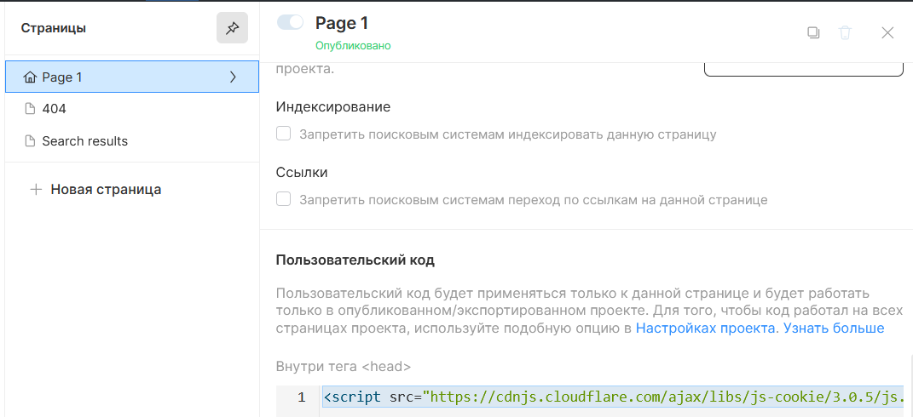
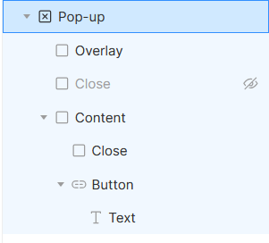
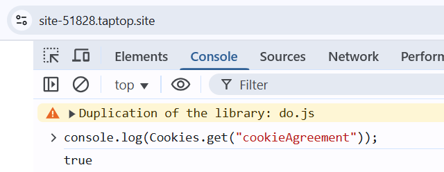

# Подключение расширения для обработки cookie

Это расширение автоматически отображает всплывающее окно (popup) для получения согласия пользователя на обработку cookie. При первом посещении сайта, если пользователь еще не дал согласие, окно появляется автоматически. После того как пользователь либо соглашается, либо отказывается от использования cookie, баннер скрывается, а его выбор сохраняется для последующих визитов.

---

## Как это работает

1. **Первичный визит:**  
   При заходе на сайт, если cookie с именем `cookieAgreement` не найдено, появляется всплывающее окно с запросом на согласие.

2. **Действие пользователя:**  
   Пользователь может либо согласиться, либо отказаться от обработки cookie. В зависимости от выбранного действия устанавливается cookie `cookieAgreement` со значением `"true"` (согласие) или `"false"` (отказ). По умолчанию, cookie сохраняется на 7 дней, но этот срок можно изменить.

3. **Повторные визиты:**  
   При повторном посещении сайта, если cookie уже установлен, всплывающее окно не отображается.

---

## Пошаговая инструкция по подключению

### Шаг 1. Подключение библиотеки cookie-js

Для работы с cookie необходимо подключить библиотеку [js-cookie](https://github.com/js-cookie/js-cookie). Для этого:

1. Откройте настройки страницы.



2. В блоке **"Внутри тега head"** вставьте следующий код:

   ```html
   <script
     src="https://cdnjs.cloudflare.com/ajax/libs/js-cookie/3.0.5/js.cookie.min.js"
     integrity="sha512-nlp9/l96/EpjYBx7EP7pGASVXNe80hGhYAUrjeXnu/fyF5Py0/RXav4BBNs7n5Hx1WFhOEOWSAVjGeC3oKxDVQ=="
     crossorigin="anonymous"
     referrerpolicy="no-referrer"
   ></script>
   ```

### Шаг 2. Вставка кода для работы с cookie

В блоке **"Внутри тега body"** добавьте следующий скрипт:

```html
<script type="module">
  document.addEventListener("DOMContentLoaded", () => {
    const consentBanner = document.querySelector(".popup-cookie");
    const consentButton = document.querySelector(".button-cookie");
    const noConsentButton = document.querySelector(".button-no-cookie");

    // Функция для скрытия баннера
    const hideBanner = () => {
      if (consentBanner) {
        consentBanner.style.display = "none";
      }
    };

    // Если cookie "cookieAgreement" не установлено, показываем баннер
    if (Cookies.get("cookieAgreement") === undefined && consentBanner) {
      consentBanner.style.display = "flex";
      // Устанавливаем display для всех дочерних элементов
      Array.from(consentBanner.children).forEach((child) => {
        child.style.display = "flex";
      });

      // Обработчики для закрытия баннера (кнопка закрытия и клик по оверлею)
      const closeBtn = consentBanner.querySelector(
        ".pop-up__inside-close-button"
      );
      if (closeBtn) {
        closeBtn.addEventListener("click", hideBanner, { once: true });
      }

      const overlay = consentBanner.querySelector(".pop-up__overlay");
      if (overlay) {
        overlay.addEventListener("click", hideBanner, { once: true });
      }
    }

    // Обработчик кнопки согласия
    if (consentButton) {
      consentButton.addEventListener("click", () => {
        Cookies.set("cookieAgreement", "true", { expires: 7, path: "/" });
        hideBanner();
      });
    }

    // Обработчик кнопки отказа
    if (noConsentButton) {
      noConsentButton.addEventListener("click", () => {
        Cookies.set("cookieAgreement", "false", { expires: 7, path: "/" });
        hideBanner();
      });
    }
  });
</script>
```

**Примечание:**  
По умолчанию cookie сохраняется на 7 дней. Если требуется изменить этот срок, замените значение свойства `expires` на нужное количество дней. Например, для 30 дней:

```javascript
Cookies.set("cookieAgreement", "true", { expires: 30, path: "/" });
```

### Шаг 3. Присвоение пользовательских классов элементам

Для корректной работы скрипта необходимо назначить определенные классы элементам на странице через интерфейс **Taptop**:

- **Popup:** `popup-cookie`
- **Кнопка согласия:** `button-cookie`
- **Кнопка отказа:** `button-no-cookie`

_Пример настройки в интерфейсе:_




---

## Проверка работоспособности

Чтобы убедиться, что расширение корректно сохраняет выбор пользователя, выполните следующие шаги:

1. Откройте сайт и нажмите на одну из кнопок (согласие или отказ).
2. Откройте консоль разработчика в браузере (нажмите `F12` или `Ctrl+Shift+I`).
3. Перейдите на вкладку **Console** и введите:

   ```javascript
   console.log(Cookies.get("cookieAgreement"));
   ```

4. Если в консоли отображается значение `"true"` или `"false"`, значит, все настроено правильно.

   
